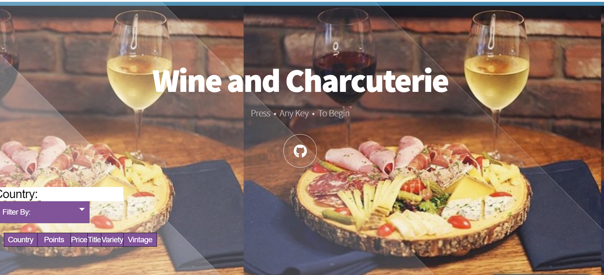
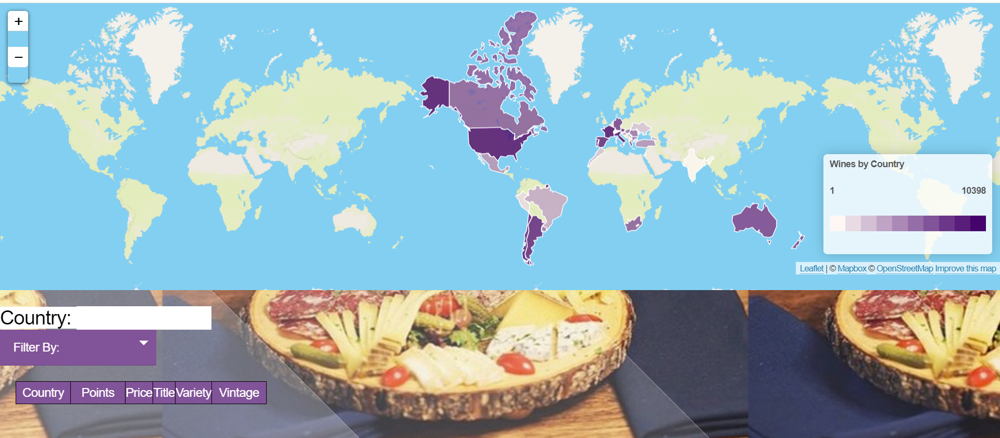
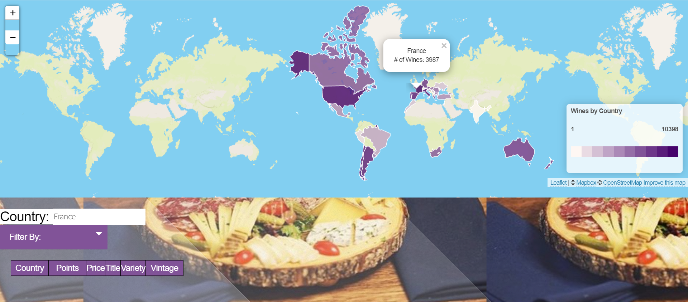
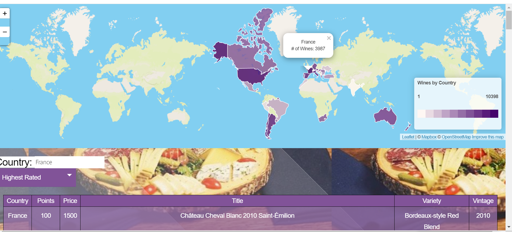
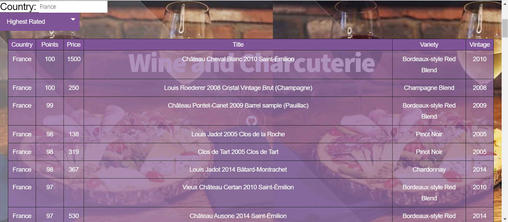
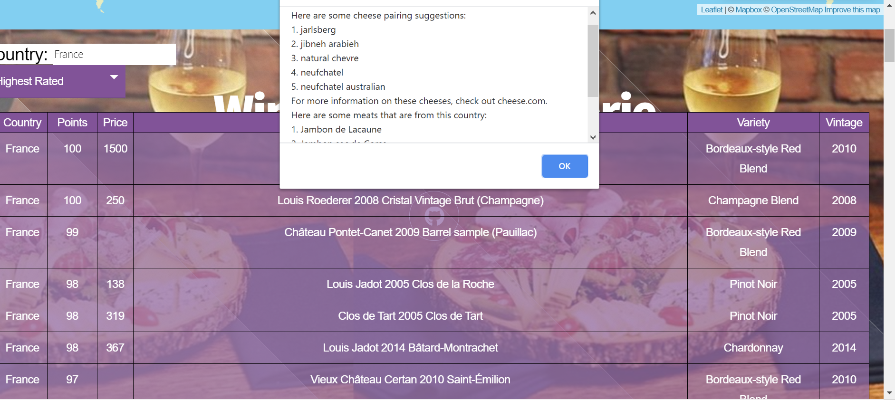
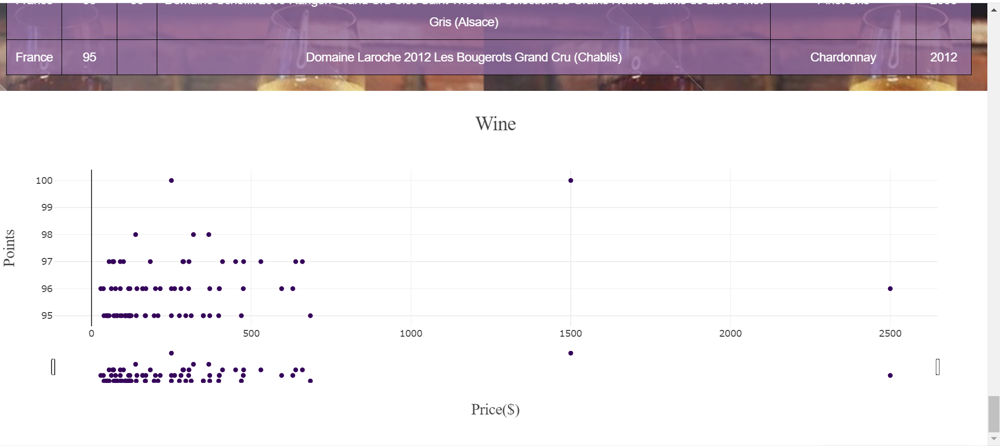

# **Wine and Charcuterie Dashboard**

Welcome to the Wine and Charcuterie Dashboard. We used data from [data.world](https://data.world/markpowell/global-wine-points) to get information on different wines, as well as the country they were made in, variety, vintage, etc. We web-scraped cheese information from [cheese.com](https://cheese.com/), and also got meat information from [tasteatlas.com](https://www.tasteatlas.com/). We created an interactive dashboard to display wine by country, visualize wine rating vs price, and provide meat and cheese pairing suggestions. 

# To Navigate:

Click _any key_ on your keyboard to view the choropleth that shows the density of wines that we have information on, per country.

Click a country to view information.

Select a filter.

From there, a table pops up with the 100 wines most applicable to the filter selected.

If you click on a row with a wine you are interested in, an alert will show the cheese and meat pairings suggestions:

Further down there is a scatter plot that visualizes the wines from the table with with price vs rating:

